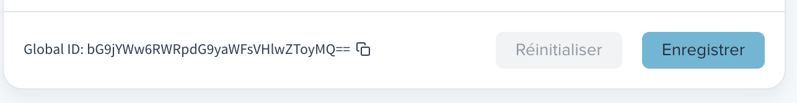

# Sirius import article

Step-by-step tutorial on how to import an article into Sirius app with the GraphQL API

## Summary

- [Playground](#playground)
- [Data source](#data-source)
- [Data correspondence](#data-correspondence)
- [Prerequisites](#prerequisites)
  - [Get the "Article" layout id](#get-the-factuel-editorial-type-id)
  - [Get the "Factuel" editorial type id](#get-the-factuel-editorial-type-id)
  - [Source creation](#source-creation)
  - [Tags creation](#tags-creation)
  - [Author creation](#author-creation)
  - [Images import](#images-import)
- [Article creation](#article-creation)

## Playground

GraphQL queries and mutations will be execute in Sirius GraphQL <a href="https://lemonde.sirius.press/api/graphql">playground</a>.

Log yourself in Sirius to access the Playground.

## Data source

In this tutorial, we will import [this article](https://dev.to/dhanushxeno/react-souce-code-visible-4e57) from [DEV.to API](https://docs.forem.com/api).

We curl the API and store the result in [article.json](article.json) file.

```shell
curl https://dev.to/api/articles/768225 > article.json
```

## Data correspondence

Correspondence between article data and Sirius fields.

| User data     | Sirius author fields |
| ------------- | -------------------- |
| name          | name                 |
| profile_image | avatarId             |

| Image data  | Sirius image fields |
| ----------- | ------------------- |
| cover_image | file                |

| Article data | Sirius article fields |
| ------------ | --------------------- |
| title        | title                 |
| description  | chapo                 |
| tags         | tagIds                |
| body_html    | blocks                |
| user         | signatures            |

| Article data | Sirius teaser fields |
| ------------ | -------------------- |
| social_image | featureImage         |

| Publication data | Sirius publication fields |
| ---------------- | ------------------------- |
| published_at     | ???                       |

Some data from DEV.to API can't be imported in Sirius API.

<details>
<summary>Show ignored article data list</summary>

| Ignored article data |                          |                        |                |
| -------------------- | ------------------------ | ---------------------- | -------------- |
| type_of              | id                       | readable_publish_date  |  slug          |
| path                 | comments_count           | public_reactions_count |  collection_id |
| published_timestamp  | positive_reactions_count | last_comment_at        | canonical_url  |
| reading_time_minutes | tag_list                 | body_markdown          | url            |
| created_at           | edited_at                | crossposted_at         |                |

| Ignored user data |          |                 |             |
| ----------------- | -------- | --------------- | ----------- |
| twitter_username  | username | github_username | website_url |
| profile_image_90  |          |                 |             |

| Ignored flare_tag data |              |                |
| ---------------------- | ------------ | -------------- |
| name                   | bg_color_hex | text_color_hex |

</details>

## Prerequisites

To create an [article](https://lemonde.sirius.press/developer/docs/graphql-api/schema/#article) on Sirius API we use the [createArticle](https://lemonde.sirius.press/developer/docs/graphql-api/schema/#mutation) mutation with a [createArticleInput](https://lemonde.sirius.press/developer/docs/graphql-api/schema/#createarticleinput) param.

First, we have to create or get linked resources :

- Get the required fields data : the layout and editorial type ids
- Create new linked resources:
  - The "source"
  - The "tags"
  - The "author"
- Import the images

### Get the "Article" layout id

Execute this [articleLayouts](https://lemonde.sirius.press/developer/docs/graphql-api/schema/#query) query in the [Playground](#playground) to get "Article" layout id.

```graphql
query Layouts {
  articleLayout(key: "article") {
    id
    name
  }
}
```

The return is :

```json
{
  "data": {
    "articleLayout": {
      "id": "bG9jYWw6TGF5b3V0OjE=",
      "name": "Article"
    }
  }
}
```

The "article" `layoutId` : _bG9jYWw6TGF5b3V0OjE=_

### Get the "Factuel" editorial type id

There is a admin page for the editorial types. The editorial type id are displayed on their dedicated page.

- Go to [editorial types admin page](https://lemonde.sirius.press.sirius.press/cms-client/admin/article/editorial-types).
- Click on "Factuel".
- At the bottom-end of page, copy the [Global ID](https://lemonde.sirius.press/developer/docs/guides/global-id/). This global id is the research `editorialTypeId`



The `editorialTypeId` is : _bG9jYWw6RWRpdG9yaWFsVHlwZToyMQ==_

ps. we could have use the [editorial type](https://lemonde.sirius.press/developer/docs/graphql-api/schema/#editorialtype) query to retrieve the same id.

### Source creation

We use [CreateSource](https://lemonde.sirius.press/developer/docs/graphql-api/schema/#mutation) mutation to create "dev.to" source.

```graphql
mutation CreateSource {
  createSource(input: { key: "dev_to", name: "dev.to" }) {
    id
  }
}
```

The sourceId is: _bG9jYWw6U291cmNlOjE4_

### Tags creation

Execute these mutations to create the Tags :

```graphql
mutation CreateRubric {
  createRubric(input: { key: "javascript", name: "javascript", main: true }) {
    id
    name
  }
}
mutation CreateRubric {
  createRubric(input: { key: "react", name: "react", main: false }) {
    id
    name
  }
}
mutation CreateRubric {
  createRubric(input: { key: "showdev", name: "showdev", main: false }) {
    id
    name
  }
}
mutation CreateRubric {
  createRubric(input: { key: "discuss", name: "discuss", main: false }) {
    id
    name
  }
}
```

The tags ids are :

- javascript: _bG9jYWw6VGFnOjM5MTYy_
- react: _bG9jYWw6VGFnOjM5MTYz_
- showdev: _bG9jYWw6VGFnOjM5MTYx_
- discuss: _bG9jYWw6VGFnOjM5MTY0_

### Author creation

Execute the [createAuthor](https://lemonde.sirius.press/developer/docs/graphql-api/schema/#query) query to create new author named "DHANUSH N". The return authorId is: _bG9jYWw6QXV0aG9yOjY=_

```graphql
mutation CreateAuthor {
  createAuthor(input: { name: "DHANUSH N" }) {
    id
    name
  }
}
```

### Images import

In the article JSON we can read the links of these images :

- The cover image
- An image in the article body
- The user profile image with 90px height
- The user profile image with 640px height

We will import the three firsts and ignore the last one.

#### Import cover image

```json
{
  "cover_image": "https://res.cloudinary.com/practicaldev/image/fetch/s--vvaIehy5--/c_imagga_scale,f_auto,fl_progressive,h_420,q_auto,w_1000/https://dev-to-uploads.s3.amazonaws.com/uploads/articles/3fg8ztmywdcuossl75ch.png"
}
```

We need the "photo" media type :

- Go to [media types admin page](https://local.sirius.press/cms-client/admin/medias)
- Click on "Photo"
- Copy [Global ID](https://lemonde.sirius.press/developer/docs/guides/global-id/): _bG9jYWw6TWVkaWE6Mg==_

```javascript

```

## ??

```graphql
mutation CreateArticle {
  createArticle(
    input: {
      layoutId: bG9jYWw6TGF5b3V0OjE=
      editorialTypeId: RpdG9yaWFsVHlwZToyMQ==
      sourcings: [{ sourceId: c3RnLWxlbW9uZGU6 }]
      title: "Station Research Today Benefitting Astronauts and Earthlings",
      chapo: "",
      tagIds: [bG9jYWw6TGF5b3V0OjE=, bG9jYWw6TGF5b3V0OjE=]
      signatures: [{ authorId: 9uZGU6U291cmNlOjY= }]
      blocks: [
        {
          type: text
          textBlock: {
            textType: paragraph
            html: "Astronaut Megan McArthur signs her name next to the SpaceX CRS-22 cargo mission sticker before the Cargo Dragon’s departure last week."
          }
        }
      ]
    }
  ) {
    id
  }
}
```
